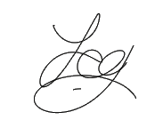

# 🔴 Input Recorder

🔴 Input (keyboard & mouse) recorder and player 

- 👨‍🔬 Still beta
- 👀 Check out [this repo](https://github.com/niekvdbos/Clicker) for working recorder tool

## 📦 Dependencies

- [🖱️ mouse](https://github.com/boppreh/mouse)
- [⌨️ keyboard](https://github.com/boppreh/keyboard)

## 🔗 Links

- [👨‍💻 Python scripts collections](https://github.com/boppreh/Python-scripts-collection)

## 💖 Support & Contact

​[​​](https://github.com/yedhrab) [​​](https://www.linkedin.com/in/yemreak/) [​​](https://yemreak.com/) [​​](mailto:yemreak.com@gmail.com?subject=%20%7C%20GitHub)​

​[​](https://www.patreon.com/yemreak/)

## 🔏 License

**The** [**Apache 2.0 License**](https://choosealicense.com/licenses/apache-2.0/) **©️ Yunus Emre Ak**

